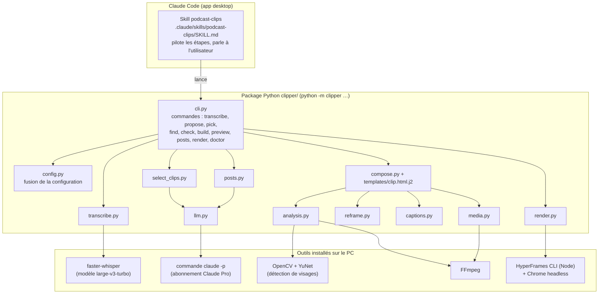
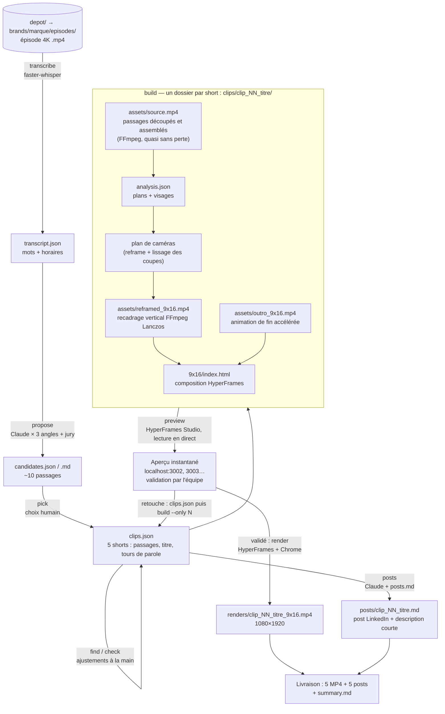
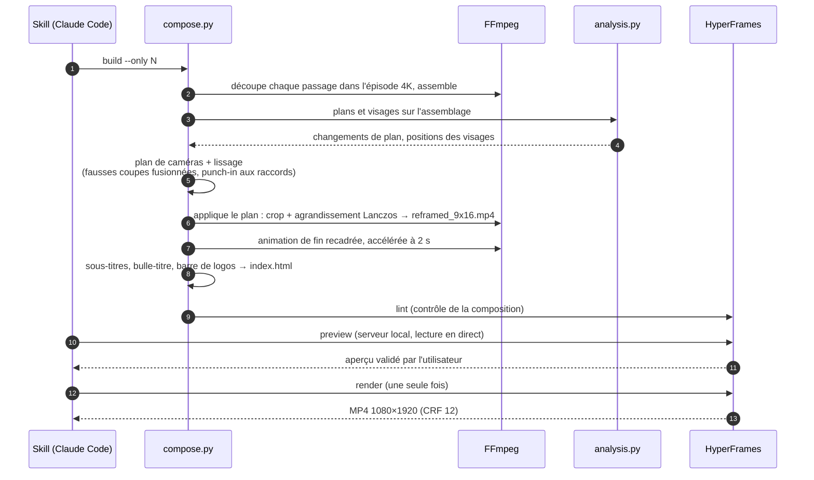

# Architecture technique

Ce document explique **comment le framework fonctionne sous le capot** : quels programmes tournent, dans quel
ordre, quels fichiers ils produisent. Pour **utiliser** l'outil, voir le guide [FRAMEWORK.md](FRAMEWORK.md).

## 1. Les briques

| Brique | Rôle |
| --- | --- |
| **Skill** `podcast-clips` | Mode d'emploi lu par Claude Code : enchaîne les commandes, pose les questions, vérifie, livre. Ne contient pas de code. |
| `cli.py` | Point d'entrée `python -m clipper <commande>`. Chaque étape lit et écrit des fichiers dans `output/` (reprise possible à tout moment). |
| `config.py` | Fusionne `config/defaults.yaml` ← `config/presets/<preset>.yaml` ← `brands/<marque>/brand.yaml` ← surcharges par format. |
| `transcribe.py` | Whisper sur CPU : texte mot à mot avec horodatage, découpé en phrases. |
| `select_clips.py` + `llm.py` | Envoie la transcription (phrase par phrase, avec horaires) et `guidelines.md` à Claude ; 3 lectures en parallèle (une par angle) puis un jury. Cale chaque passage sur les mots cités. |
| `analysis.py` | Détecte les changements de plan et les visages (position, taille, qui parle). |
| `reframe.py` | Calcule le plan de caméras vertical : quel cadrage à quel moment (gros plan, écran partagé, punch-in). |
| `captions.py` | Regroupe les mots en blocs de sous-titres (3 lignes, mot à mot). |
| `compose.py` | Assemble les passages, lisse les coupes, recadre avec FFmpeg, écrit la composition HTML HyperFrames (sous-titres, bulle-titre, logos, light leak, carte de fin). |
| `media.py` | Toutes les opérations FFmpeg : découpe, concaténation, recadrage Lanczos, animation de fin. |
| `render.py` | Rendu de la composition en MP4 par HyperFrames (Chrome headless), lint, captures. La commande `preview` lance HyperFrames Studio en arrière-plan (un port par short) pour lire les shorts en direct, sans rendu. |
| `posts.py` | Rédige le post LinkedIn de chaque short avec `posts.md` (méthode + exemples). |

## 2. Le parcours d'un épisode, fichier par fichier

Tout est rangé dans `output/<marque>/<episode>/` (jamais versionné). Chaque fichier intermédiaire est
lisible et modifiable : on peut corriger `clips.json` à la main puis relancer seulement `build` et `render`
pour le short concerné (`--only N`).

## 3. Ce qui se passe pendant le montage d'un short

## 4. Les garde-fous intégrés

| Règle | Où c'est codé |
| --- | --- |
| Ne jamais couper une pensée : coupes calées sur les premiers / derniers mots cités, marge audio limitée au silence disponible | `select_clips.snap_to_quotes`, `_snap` ; contrôle `clipper check` |
| Pas de saccades : les fausses coupes sont détectées par différence d'image et fusionnées ; raccord entre passages = punch-in | `compose._smooth_plan`, `_frame_diff`, `_punch_junctions` |
| Netteté : recadrage par FFmpeg depuis la 4K, intermédiaires CRF 10, images PNG, rendu CRF 12 | `media.reframe_video`, `cut_segment`, `config/defaults.yaml` → `render` |
| Posts sans invention : seule la transcription du short est fournie à Claude, consigne de ne rien ajouter | `posts.py` |
| Navigateur bloqué par Windows : repli automatique sur Chrome / Edge installés | `render.fallback_browser` |
| Installation vérifiée | `python -m clipper doctor` |

## 5. Où modifier quoi (pour un développeur)

- **Le look** (bulle, sous-titres, logos, carte de fin) : `clipper/templates/clip.html.j2` + les options de
  `config/presets/aip-short.yaml`. Valider avec `npx hyperframes lint` dans le dossier d'un short.
- **La sélection** : le prompt système dans `select_clips.py`, les angles dans `brand.yaml` → `selection.angles`.
- **Les posts** : le prompt dans `posts.py`, la méthode dans `brands/<marque>/posts.md`.
- **Le cadrage** : `reframe.py` (plan de caméras) et `compose._smooth_plan` (lissage).
- Les règles produit à ne pas casser et les pièges connus sont listés dans [CLAUDE.md](../CLAUDE.md).
