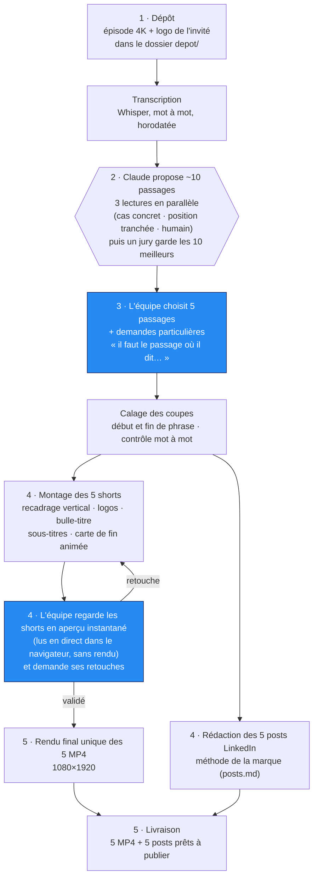
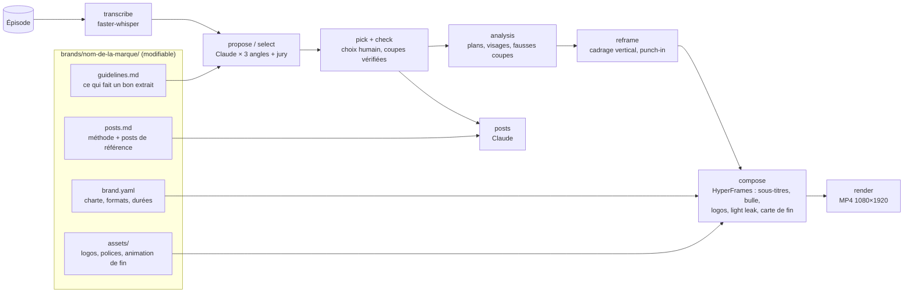

# Comment fonctionne le framework « Podcast → shorts »

Un épisode entier entre, cinq shorts verticaux montés et leurs posts LinkedIn sortent. Claude fait le travail
répétitif (transcrire, repérer, couper, monter, rédiger) ; l'équipe garde les deux décisions éditoriales :
**quels passages** et **ce qu'il faut absolument inclure**.

## Le workflow en 5 étapes

| Étape | Qui | Durée (PC sans GPU, épisode de 50 min) |
| --- | --- | --- |
| 1. Dépôt + transcription | vous déposez, Claude transcrit | ≈ 20 min (automatique) |
| 2. 10 propositions | Claude | ≈ 8 min |
| 3. Choix + demandes | **vous** | 2 min |
| 4. Montage + aperçu + posts | Claude monte, **vous regardez et validez** | ≈ 4 min de montage (≈ 10 en 4K), aperçu instantané, ≈ 1 min par retouche |
| 5. Rendu final + livraison | Claude | ≈ 30–40 min pour 5 shorts, une seule fois, en arrière-plan |

**Aperçu ou rendu ?** Un short est d'abord une « page » (vidéo + sous-titres, logos, transitions programmés par
dessus). L'**aperçu** la joue en direct dans le navigateur : immédiat, idéal pour vérifier et corriger. Le
**rendu** la transforme en fichier MP4 image par image (≈ 7 min par short) : on ne le fait qu'une fois, à la fin.

## Ce qui se passe à l'intérieur

(Version détaillée pour les curieux et les développeurs : [ARCHITECTURE.md](ARCHITECTURE.md).)

- **Jamais couper une pensée** : Claude cite les premiers et derniers mots de chaque passage ; le code cale la
  coupe exactement sur ces mots, puis on vérifie mot à mot (`check`).
- **Montage fluide** : seules les vraies coupes de caméra de l'épisode sont gardées (les fausses coupes sont
  détectées par différence d'image) ; un raccord entre deux passages devient un léger zoom.
- **Netteté** : le recadrage vertical est fait par FFmpeg à partir de la source 4K, puis rendu en 1080×1920.

## Modifier le format (tout est dans des fichiers texte)

| Je veux changer… | Fichier | Exemple |
| --- | --- | --- |
| la durée des shorts, le nombre de propositions | `brands/<marque>/brand.yaml` → `selection` | `min_duration: 25`, `max_duration: 45` |
| les formats (vertical, LinkedIn 16:9, carré) | `brand.yaml` → `formats` | `["9x16", "16x9"]` |
| ce que Claude doit chercher / éviter | `brands/<marque>/guidelines.md` | « éviter les passages sur la levée de fonds » |
| le style des posts LinkedIn | `brands/<marque>/posts.md` | coller de nouveaux posts publiés en exemples |
| les logos, la police, l'animation de fin | `brands/<marque>/assets/` | remplacer `outro_anim.mov` |
| le texte du bouton de fin | `brand.yaml` → `outro.cta.text` | « ▶ L'ÉPISODE COMPLET SUR AI CORNER » |
| le style de montage (bulle, sous-titres, coupes) | `config/presets/aip-short.yaml` | taille des sous-titres, durée de la bulle |
| tout le reste (valeurs par défaut commentées) | `config/defaults.yaml` | — |

Le plus simple reste de le demander à Claude dans Claude Code (« les sous-titres plus gros », « shorts de
45 secondes ») : il sait quel fichier modifier.

## Ajouter un autre podcast

`python -m clipper new-brand <nom>` crée `brands/<nom>/` à partir du modèle. Déposez 2 ou 3 shorts déjà publiés
et quelques posts LinkedIn dans `depot/` et demandez à Claude de « caler la charte sur ces exemples ».
